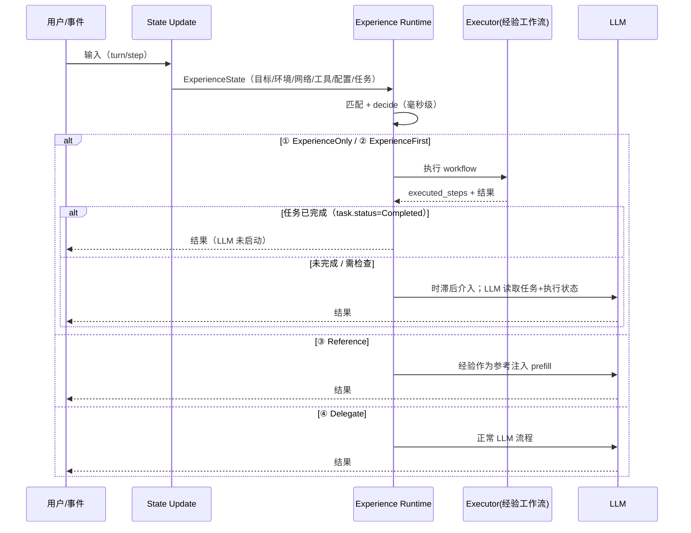
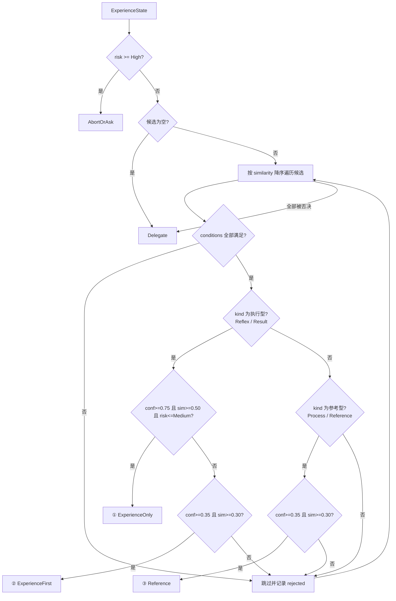
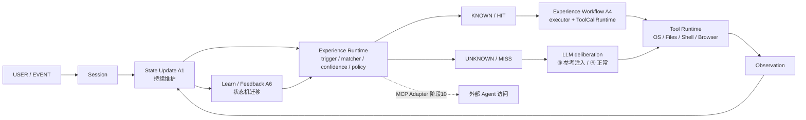

# Experience Runtime 设计：伪平行决策模型（阶段 3-4）

> 状态：设计定稿，阶段 3-4 主体已落地（状态/A1、匹配/A2、决策/A3、执行器/A4、
> store、confidence/A6；见 §10 对照图）
> 前置：`experience-agent-loop.md`（控制流）、`experience-reference-prior-art.md`（借源）

## 0. 架构不变量（不可破坏）

> 2026-09-02 用户声明后固化。coding 中任何改动违反以下任一条即视为偏差，
> 必须停下检查。

1. **Experience 是 agent 架构的内嵌 native capability**——位于 codex-core
   内部、挂载于 `SessionServices`、决策点嵌入 `run_turn`。它不是 MCP、不是
   skill、不是插件。
2. **LLM 永远不能把 Experience 当作工具调用**——tools 注册表中不存在
   experience 工具；控制方向只能是 `Experience Runtime →（跳过/调用）LLM`。
3. **Skill 与 MCP 作为 agent 原有能力保留**：skill 是给 LLM 读的文档，MCP
   是外部工具/连接器。Experience 执行可经原生 `ToolRouter` 调用同一工具通道
   （含 agent 配置的 MCP 工具），但 Experience 本身不是它们。
4. **MCP 仅作为"外部 Agent / 管理 UI 访问 Experience"的适配器**（阶段 10 /
   M2-6 / M2-3b 的传输层），永不进入 agent 内部决策路径；pin 等管理写操作
   直写原生 store。
5. 代码检查基线：`experience/` 模块对 MCP 零引用；tools 注册表无 experience
   工具（2026-09-02 已核）。

## 1. 核心思想：Experience 不是 LLM 的前置条件

一个常见误解是把 Experience 系统写成硬闸门：

```text
（错误）输入 → 经验验证 → 通过才放行 → LLM
```

这是"先决条件"语义。本项目明确**不这样做**。正确语义是**伪平行（pseudo-parallel）**：

- 经验系统是**快路径**：状态构建 + 匹配 + 决策都是确定性的毫秒级运算；
- LLM 是**慢路径**：如果需要启动，它的"时滞"恰好等于经验系统决策完成的时间；
- 经验系统在时滞内如果**完成了任务**，LLM 根本没有必要启动（零 LLM 调用）；
- 如果**没有完成**，LLM 在时滞结束后才介入，并且**可以读取任务的执行状态与任务本身**，
  再决定是否介入、介入到什么程度。

一句话：**LLM 不是被经验"验证后放行"，而是被经验"先试跑后豁免"——豁免不了才轮到它。**

## 2. 四层控制 + 冲突

| 层 | 决策 | 含义 | LLM 角色 |
|---|---|---|---|
| ① | `ExperienceOnly(id)` | 完全不用 LLM：经验执行并完成任务 | 零调用 |
| ② | `ExperienceFirst(id)` | 经验为主，LLM 仅检查：经验先执行，未完成时 LLM 读取执行状态后介入 | 检查/接管 |
| ③ | `Reference(id)` | 经验为参考，LLM 为主：经验内容作为参考注入（prefill），LLM 主导 | 主导 |
| ④ | `Delegate` | 无经验 / 经验不可信：完全依赖 LLM | 完全依赖 |
| 冲突 | `AbortOrAsk` | 高风险 / 前置条件冲突：停止自动执行，询问用户或显式交回 LLM | 裁定/询问 |

其中 ① 和 ② 会**先执行经验工作流**，③ 和 ④ 直接进 LLM（③ 带参考注入）。

## 3. 时序图（伪平行 + 时滞）



ASCII 简化版：

```text
输入 → [状态构建] → [匹配] → [决策]
                              ├─ ①/② → [执行经验工作流]
                              │          ├─ 完成 → 直接返回（LLM 0 次）
                              │          └─ 未完成 → LLM 读取执行状态 → 介入
                              ├─ ③ → LLM（注入经验参考）
                              ├─ ④ → LLM（正常流程）
                              └─ 冲突 → 停止自动执行 → 询问/LLM 裁定
```

## 4. 决策流程与算法

### 4.1 决策流程图



### 4.2 决策算法（伪代码）

```text
decide(state, candidates):
    if state.risk >= High:                    return AbortOrAsk
    for candidate in candidates (sim 降序):
        if not all(conditions 满足 via state.satisfies):  continue   # rejected
        match candidate.kind:
            Reflex | Result:
                if conf >= 0.75 and sim >= 0.50 and risk <= Medium:
                    return ExperienceOnly(candidate.id)
                if conf >= 0.35 and sim >= 0.30:
                    return ExperienceFirst(candidate.id)
            Process | Reference:
                if conf >= 0.35 and sim >= 0.30:
                    return Reference(candidate.id)
    return Delegate
```

设计要点（借自参考实现并吸收用户思想）：

1. **候选按匹配质量排序，置信度只决定"信任到什么程度"，不参与排序**——避免高置信
   弱匹配挤掉低置信强匹配。
2. **执行型（reflex/result）可以绕过 LLM；参考型（process/reference）只做参考注入**，
   因为参考型经验的价值是"在黑盒中放吸铁石、节省 token"，而不是追求零 LLM。
3. **被否决的候选逐一记录**（rejected），供事后审查与 LLM 轻介入。
4. ① 与 ② 的差别在执行后：① 预期任务完成（零 LLM）；② 预期需要 LLM 检查。
   实际是否完成由 `task.status` 判定——① 执行后若未完成，自动升级为 ② 语义
   （LLM 介入读取执行状态）。
5. **平行 LLM 参考带（相似但不确认）**：`Process/Reference` 型经验即使未达
   assist 门槛，只要 `conf ≥ 0.25 且 sim ≥ 0.10` 就以 ③ Reference 注入——
   让平行 LLM 辅助"相似但不确认"的匹配，经验只作参考、LLM 保持主导。

## 5. 状态模型（ExperienceState）

```text
ExperienceState
├── current_goal / current_context        # 目标与意图
├── environment / network / tools / config# 经验依赖的状态元素（可快速唤起/跳过）
├── task (description + status)           # 任务本身 + 执行状态（新增）
├── executed_steps: Vec<String>           # 经验已执行步骤（LLM 可读，新增）
├── active_experience / execution_mode    # 当前经验与行为模式
├── confidence / risk                     # 当前信任与风险
└── last_action / last_result             # 最近动作与结果
```

`TaskStatus`：`Pending → InProgress → Completed / Failed / NeedsLlm`

- `Completed`：任务完成，LLM 不必介入（②/① 的免 LLM 判定依据）；
- `Failed`：经验执行失败；
- `NeedsLlm`：显式标记需要 LLM 介入（未完成/失败/异常）。

**统一 key 面（lookup）**：条件的免 LLM 检查与 LLM 的介入读取共用同一套 key：

| key | 含义 |
|---|---|
`task.description` / `task.status` / `task.completed` | 任务本身与执行状态 |
`executed_steps` | 经验已执行步骤 |
`environment.cwd` / `environment.detection.*` | 环境配置与检测 |
`network.policy` / `network.reachability` | 网络配置 |
`tools.available` | 工具配置 |
`config.workspace_roots` | 工作区配置 |

> 用户原则落点：**条件通过 → LLM 不读取；条件不通过、LLM 介入时 → 读同一套 key。**

## 6. 所需算法清单

### A1 状态构建（State Update）
```text
输入: turn_context / step_context / world_state / user_input
1. intent  ← user_input（Text/Mention 拼接）
2. goal    ← intent（v1）
3. context ← environment_key + intent
4. environment ← 首个 ready 环境：environment_id / cwd / sandbox_level
   （workspace_roots 也来自 TurnEnvironment）
5. network ← turn_context.network 是否存在（v1: policy="configured"）
6. tools / detections ← TODO（phase 4：tool_router / 环境检测）
7. task    ← intent，status=Pending（v1；跨轮连续性后续接 executor）
8. executed_steps 空（v1）
```

**实现**：`session/experience_state_builder.rs`（`build_experience_state` +
`update_experience_state`），已接入 `run_turn`。tools 来自
`selected_capability_roots`，detections 来自平台 OS + `.git` 存在性；
循环内 `update_experience_state` 刷新状态元素但保留 task/executed_steps，
实现跨采样连续性。experience 模块保持独立。

### A2 匹配（Matcher）——"验证有无对应经验"

验证分两层，各有明确职责：

| 层 | 职责 | 归属 | 状态 |
|---|---|---|---|
| 内容层 | 当前任务/意图/目标是否对应经验的 trigger（"是不是这个任务"） | `experience_matcher.rs`（`match_experiences`） | ✅ 已实现 |
| 状态层 | 经验依赖的状态元素（conditions）是否满足 + 置信度/相似度是否可信（"能不能现在做"） | `ExperienceRuntime::decide` | ✅ 已实现 |

内容层算法（v1，确定性、可测）：
```text
match_experiences(state, experiences):
    candidates = []
    for exp in experiences:
        if exp.status not in {Validated, Active}: continue     # 未成熟经验不参与
        sim = combined_similarity(state, exp)
        if sim < MIN_SIMILARITY (0.10): continue               # 过滤向量噪声
        candidates.append((exp, sim))
    return sort(candidates, by=sim desc)

combined_similarity(state, exp) = rule×w_rule + tag×w_tag + vec×w_vec
  rule   = 关键词/字段子串命中（content_similarity）
  tag    = 状态 token 与 trigger token 的 Jaccard 重叠
  vec    = 哈希 n-gram（1+2-gram, 96 维, FNV-1a）余弦
  类型权重: reflex(0.65/0.20/0.15) result(0.60/0.20/0.20)
           process(0.45/0.25/0.30) reference(0.30/0.20/0.50)
```

设计要点：
1. **条件不在此层评估**——内容层只回答"有没有"，状态层才回答"能不能"，
   避免把状态元素混进相似度打分。
2. 未成熟经验（NEW/CANDIDATE/DECAYING/DISABLED）不参与匹配。
3. 候选按 sim 降序进入 decide，符合"匹配质量排序、置信度只决定信任度"的原则。

✅ 三元匹配已实现（rule/tag/vector + 类型权重 + MIN_SIMILARITY）。
后续升级：BM25 精排、上下文标签（module/page/task）注入。

### A3 决策（Decision）
见 §4.2。输入 = state + 排序候选；输出 = `ControlDecision` 五态。

### A4 执行与完成判定（Executor）
```text
execute(state, experience):
    state.task.status = InProgress
    for step in experience.workflow.steps:
        result = run(step)                    # 复用 ToolCallRuntime / exec 通道
        state.executed_steps.push(step.name)
        state.last_action = step
        state.last_result = result
        if result.ok == false:
            state.task.status = Failed
            return
    state.task.status = Completed             # 或由校验步骤显式判定
```
完成判定必须可观测：`task.status == Completed` 是免 LLM 的唯一依据。

**实现**：`experience/experience_executor.rs`（`execute_workflow` +
`ExperienceActionRunner` trait）+ `session/experience_action_runner.rs`
（session 层 runner）。①/② 已接入 `run_turn`：命中且 `Completed` → `break`
跳过 LLM（零 LLM 路径真实生效）。v1 runner 只执行安全只读动作
（env.cwd / env.detect.git / fs.exists / noop）；真实工具动作（shell/文件/
浏览器，经审批与沙箱）留待 ToolCallRuntime 集成。空 workflow → `NeedsLlm`。

### A5 LLM 接管（Handoff）
```text
handoff(state):
    payload = {
      task: task.description,
      task_status: task.status,
      executed_steps: executed_steps,        # 已做了什么
      last_result: last_result,              # 做到哪一步
      state_elements: lookup("environment.*"|"network.*"|"tools.*"|"config.*"),
    }
    # 若条件通过，state_elements 可精简；不通过时全量给出
    return prompt_extension(payload)
```

**实现**：`ExperienceState::handoff_payload()` 已落地（task / task_status /
executed_steps / last_action / last_result / environment / network / tools），
与条件检查共用同一套 lookup key。

## 9. 平行 LLM：浮动时滞、质疑权与"意识"类比

用户确立的语义：**LLM 是大脑意识，经验是大脑的其他部分**。不是每个动作都需要
意识介入，但意识随时可以思考它想思考的内容。

落到实现：

1. **浮动时滞 = 经验系统完整操作部署时间**。经验系统先完成状态部署与工作流
   执行（A1 + A4，毫秒级、确定性）；LLM 若需要介入，一定发生在时滞之后，且
   此时它读到的是**部署后的世界状态**（`handoff_payload`），而不是任务刚开始
   的样子。
2. **平行 LLM 允许介入"相似但不确认"的匹配**。即 A2 的 hint 带
   （`Process/Reference` + conf ≥ 0.25 + sim ≥ 0.10 → ③ Reference）：经验作为
   参考注入，LLM 主导，但**不允许 LLM 立刻推进下一步**——它必须先经过时滞，
   等经验系统的结果（含已部署状态）就绪。
3. **质疑权**。`Experience::reference_text()` 让 LLM 随时可以检查经验的内容
   与步骤分解（trigger / conditions / workflow / confidence / risk），尤其是
   结果不达预期时：LLM 不是经验的下游消费者，而是可以审查经验的意识。

### A6 反馈与学习（Feedback）
```text
on_finish(state, llm_used, user_feedback):
    更新经验的多维计数：
      success/failure/streak/frequency/positive_fb/negative_fb/last_used
    confidence = PA × (base + UF×w_uf + UA×w_ua + R×w_r) × DS
      PA = success / (success + failure + 1)
      UF = min(近期使用频率, 10) / 10
      UA = (positive_fb+1) / (positive_fb+negative_fb+2)
      R  = e^(-0.05 × 距上次使用天数)
      DS = 数据稳定性（输出一致性推导，宿主可注入）
    if 连续成功达阈值 → 状态机向 Active 前进
    if 连续失败 → 降级 → Decaying → Disabled
    # 阶段 7：LLM 执行 trace 成功后 → Experience Candidate → 用户/系统验证 → Experience
```

## 7. 与 run_turn 缝隙的关系（语义修正）

缝隙仍在 `run_turn` 采样前（`turn.rs` 373-384 之间），但语义从"必须通过经验验证"
修正为**快速决策点**：

```text
decision = runtime.decide(state, candidates)
case decision:
    ExperienceOnly → 执行经验工作流；task.status==Completed → return（零 LLM）
    ExperienceFirst → 执行经验工作流；未完成 → 继续 run_sampling_request（LLM 读状态）
    Reference       → 注入经验参考到采样输入 → run_sampling_request
    Delegate        → run_sampling_request（正常）
    AbortOrAsk      → 停止自动执行 → 询问/LLM 裁定
```

## 8. 验收标准

- 单元：`decide` 五条分支（ExperienceOnly/ExperienceFirst/Reference/Delegate/AbortOrAsk）、
  拒绝链（条件不满足跳过）、高置信弱匹配不挤掉低置信强匹配（排序由 matcher 保证）。
- 单元：`task.status` 完成判定驱动"零 LLM"。
- 集成（mock client_session）：① 场景 LLM 调用 0 次；② 未完成场景 LLM 读取到
  `executed_steps`；③ 场景 prompt 含经验参考；④ 场景与基线一致。

## 10. 架构对照与回检（当前 vs 理想）

> 本节用于回检：施工到哪一步、与 10 步计划终态的差距在哪。

### 10.1 当前架构（2026-09-05：沉默审计修复链收尾后）

```mermaid
flowchart LR
    U[用户输入] --> R1[run_turn 决策点<br/>A1 状态构建/刷新 + 探测<br/>snapshot_for_learning]
    R1 --> RT[ExperienceRuntime<br/>decide_for_state]
    RT --> ST[(ExperienceStore<br/>JSON<br/>completion_criteria/failure_modes/assets<br/>+ conditions 校验)]
    ST --> M[match 三元匹配<br/>仅 Validated/Active<br/>conditions 不满足即降级]
    M --> D[decide 五态]
    D -->|④ Delegate| LLM[run_sampling_request]
    D -->|③ Reference| REF[prefill 注入<br/>reference_text+handoff] --> LLM
    D -->|①/②| EX[execute_workflow<br/>ToolCallRuntime 批准/沙箱]
    EX -->|Completed| Z[零 LLM]
    EX -.记录.-> TR[过程记录<br/>TraceRecorder call_id→成败+输出<br/>environment_snapshot+final_evidence]
    LLM -.成功 turn.-> TR
    TR --> NG[necessity gate<br/>假成功/不可执行/无改进拦截]
    NG --> PL[run_auto_pipeline<br/>experience-gen skill 蒸馏<br/>+ 干跑校验]
    PL --> CD[conditions 回填<br/>completion_criteria=final_evidence<br/>failure_modes/assets 入库]
    CD --> ST
    RT -.用户显式“记住”→ FR[force_record 放行] --> ST
    EX -.A6 反馈.-> FB[record_feedback<br/>计数+score+生命周期]
    FB --> ST
```

当前真实执行链：

```text
决策路径（每采样前）
  ├─ A1 状态：build/update + runtime 探测 + detections；turn 结束时
  │    snapshot_for_learning() 作为学习上下文
  ├─ decide_for_state → match（三元 + conditions 校验）→ decide 五态
  │    ├─ ④ Delegate / ③ Reference(prefill) / ①/② execute_workflow
  │    └─ Completed → break（零 LLM）；未完成 → LLM 读执行状态

学习路径（成功 LLM turn 后，自动、零用户交互）
  trace（actions + steps[ok/summary] + environment_snapshot + final_evidence）
    → necessity gate（learner：假成功拒绝；observe_trace：无改进重复跳过）
    → run_auto_pipeline：
         短/干净 → 直接校验激活；messy → LLM 蒸馏（遵循 experience-gen
         skill，自包含/禁临时文件/完成判据）→ 干跑校验（工具边界）
    → conditions 由 snapshot 白名单回填；completion_criteria 默认取
      final_evidence；failure_modes/assets 落库（候选 3）
    → VALIDATED → ACTIVE

放行通道
  用户明示“记住这个流程/以后都这样做”→ force_record（仅绕过无改进闸门，
  质量闸门仍生效）

状态↔经验双向
  state（探测/部署/注册表）→ 经验 conditions（生成时回填）
  → decide 命中前用当前 state 复核 conditions
```

### 10.2 理想架构（10 步计划终态）



理想流程（含时滞与质疑权）：

```text
USER/EVENT → Session → Task
  → State Update（A1：环境/网络/工具/配置/任务，跨轮连续）
  → Experience Runtime
      ① ExperienceOnly → execute_workflow → Completed → 返回（LLM 0 次）
      ② ExperienceFirst → execute_workflow → 未完成 → LLM 检查
         （LLM 读取 handoff_payload + reference_text，可质疑步骤分解）
      ③ Reference → 经验参考注入 → LLM 主导
      ④ Delegate → LLM 正常
      AbortOrAsk → 停止自动执行 → 询问/裁定
  → Tool Runtime → OS/Environment → Observation → State Update → Learn
  → Feedback（A6）→ confidence → 状态机 NEW→CANDIDATE→VALIDATED→ACTIVE→DECAYING→DISABLED
  → 阶段 7：LLM 成功 trace → Experience Candidate → 用户/系统验证 → 入库
  → 阶段 10：MCP Adapter 暴露 Experience（外部 Agent 只读访问）
```

### 10.3 当前算法逻辑（已实现的真实代码）

1. **A1 状态构建**：`session/experience_state_builder.rs::build_experience_state`
   + `update_experience_state` —— intent ← user_input；环境 ← 首个 ready
   `TurnEnvironment`（id/cwd/sandbox、workspace_roots）；网络 ← `turn_context.network`
   存在性；tools ← `selected_capability_roots`；detections ← OS + git；循环内
   保留 task/executed_steps（跨采样连续性）。
2. **A2 匹配**：`experience_matcher.rs::match_experiences`
   —— 三元匹配 `rule×w_rule + tag×w_tag + vec×w_vec`（类型分化权重）；
   仅 `Validated/Active` 参与；`sim ≥ MIN_SIMILARITY(0.10)`；sim 降序。
3. **A3 决策**：`experience_runtime.rs::decide`
   —— 高风险→AbortOrAsk；逐候选：conditions 全满足→按 kind/阈值出 ①/②/③；
   全部否决→④；`Process/Reference` 加 hint 带（conf≥0.25 且 sim≥0.10 → ③）。
4. **A4 执行**：`experience_executor.rs::execute_workflow`
   —— 顺序执行 + 状态维护；空 workflow→NeedsLlm；全成功→Completed；已由
   `session/experience_action_runner.rs` 接入 `run_turn`（安全只读 + `tool.<name>`
   经 ToolCallRuntime + `deploy.env` 部署动作；部署结果自动记录进状态注册表）。
5. **A6 置信度**：`experience_confidence.rs::ConfidenceCounters`
   —— `PA×(base+UF×w_uf+UA×w_ua+R×w_r)×DS`；成功/失败/用户反馈/tick 衰减。
6. **store**：`experience_store.rs::ExperienceStore`
   —— 内存 BTreeMap + JSON 导入导出 + matchable/stats。
7. **状态注册表**：`experience_state.rs` —— `StateElement`（key/value/source/
   verified_at/ttl）+ `upsert_element` + lookup 统一 key 面；`runtime.subprocess_allowed`
   由 turn 开始时探测写入；部署动作经 `ActionResult.deployed` 由 executor 记录。
8. **阶段 7 学习器**：`experience_learner.rs` —— `ExperienceTrace`（task/actions/
   outcome）按任务签名累计证据；连续 N 次成功或用户确认 → `build_draft` 编译为
   CANDIDATE（trigger 关键词=任务分词、workflow=trace 动作、kind=Reflex/Process、
   初始置信度 0.20）→ `observe_trace` 注册进 store。蒸馏门禁（M2 步骤 2，
   `4a1642fe4`）：`ExperienceRuntime` 可注入 `ExperienceCompiler`；messy trace
   （> MAX_AUTO_CONFIRM_STEPS 步）停留 CANDIDATE 时调用 compiler 蒸馏（脏轨迹
   → 参数化最小步骤），成功则以蒸馏结果入库；默认无 compiler 时行为不变
   （保持 CANDIDATE 待蒸馏）。
9. **阶段 9 状态机**：`experience_lifecycle.rs` —— `ExperienceLifecycle`：
   显式迁移（Validate/Activate/Disable/Revalidate）+ 置信度驱动迁移
   （`apply_feedback`：score≥0.35 → VALIDATED；≥0.75 → ACTIVE；连续失败 3 →
   DECAYING、5 → DISABLED；DECAYING 连续成功 2 → 恢复 ACTIVE）。`record_feedback`
   与 `store.transition` 已联动。
10. **阶段 8 校验/版本化**：`experience.rs` —— `Experience::validate()`
    （名称/trigger 信号/workflow 非空/步名/置信度 [0,1]/版本 ≥1）、
    `bump_version()`；`store.upsert_validated` 入库强制校验。
11. **阶段 6 行为映射**：`ControlDecision::execution_mode()` ——
    ①/② → Reflex、③/④ → Deliberation、AbortOrAsk → Conflict。

### 10.4 理想算法流程（10 步计划目标）

```text
loop per turn/step:
  state = update_state(state, turn)              # A1：连续性 + detections + tools
  candidates = matcher(state, store.matchable()) # A2：三元匹配 + BM25 + 类型权重
  decision = decide(state, candidates)           # A3：五态 + 拒绝链 + hint 带
  match decision:
    ExperienceOnly(id)  => outcome = execute(state, store[id])   # A4
                            if outcome == Completed: return      # LLM 0 次
                            else: escalate to ExperienceFirst
    ExperienceFirst(id) => execute(state, store[id])
                            if not Completed: LLM(handoff(state) + reference_text(id))
    Reference(id)       => LLM(prefill = reference_text(id))
    Delegate            => LLM(normal)
    AbortOrAsk          => ask_user()
  after LLM/execution:
    feedback(state, outcome, user_judgement)     # A6：计数 + score + 状态机迁移
    maybe_compile_new_experience(trace)          # 阶段 7
```

### 10.5 差距清单（回检表）

| 组件 | 当前 | 理想 | 差距 |
|---|---|---|---|
| A1 状态构建 | 已接入 run_turn；环境/网络/任务/workspace_roots + tools（capability roots）+ detections（OS/git）+ 跨采样连续性 | 更多环境检测（依赖目录/进程）、多环境映射 | 检测项扩展 |
| A2 匹配 | 三元匹配（rule/tag/vector）+ 类型权重 + MIN_SIMILARITY | + BM25 精排、上下文标签 | 精排升级 |
| A3 决策 | 五态 + 拒绝链 + hint 带 | 同左 + assist 细分 | 基本达标 |
| A4 执行器 | 已实现 + **已接入 run_turn**：安全只读动作 + `tool.<name>` 经 ToolCallRuntime（审批/沙箱/记录） | 全工具动作 + 结果回显 | 动作集真实验收 |
| store | 内存 + JSON | SQLite 持久化 | 后端升级 |
| confidence | 公式+反馈已实现 + **执行点反馈已接入 run_turn**（Completed→Success，否则 Failure，刷新 store 置信度） | 状态机迁移联动 | 状态机迁移（阶段 9） |
| ①/② 零 LLM 路径 | 已接线（安全动作 + tool.<name>；Completed → 跳过 LLM） | 全工具动作 + 结果回显 | 真实验收 |
| 阶段 7 学习 | **自动流水线已接通**（`ccb78ef09`+`4a1642fe4`+`23768c146`）：capture/prune（learner）→ distill（session LLM 编译）→ validate（结构 + 工具边界干跑）→ activate（同 id 替换 + VALIDATED→ACTIVE）；LLM 仅作编译器，无决策权 | trace→prune→distill→validate→activate 全自动、零用户交互 | 逐动作成败跟踪（现状启发式过滤）；真实验收 |
| 阶段 9 状态机 | 枚举有 | 迁移规则 + confidence 联动 | 未开始 |
| 阶段 10 MCP | 无 | 外部访问 adapter | 未开始 |

## 11. 自动经验产生流水线（M2 步骤 2–4 落地，`23768c146`）

把"LLM 翻车 → 以后不再翻"固化为一条**全自动、零用户交互**的流水线
（用户原则 `ce0cea72f`：产生可用经验不得要求用户再次确认，否则与外置 MCP
经验工具无异）：

```text
捕获（全量 trace，turn.rs）
  → 剪枝（experience_learner：确定性丢弃探测/安装/重复，只留成功必要动作）
  → 蒸馏（session/experience_distiller：脏轨迹触发一次小 LLM 编译调用；
        模型只输出 JSON，解析是确定性代码，LLM 没有执行权）
  → 校验（Experience::validate 结构校验 +
        experience_action_runner::validate_replayable 工具边界干跑——
        每个步骤经 ToolRouter 解析、参数非空，不执行任何动作）
  → 激活（ExperienceRuntime::admit_auto_experience：同 id 替换 + 版本递增 +
        VALIDATED → ACTIVE）
```

关键不变量：

1. **LLM 是编译器，不是决策者**：蒸馏调用不携带任何工具，模型输出仅是被
   确定性解析的 JSON；激活前必须通过结构校验 + 工具边界干跑。
2. **任何失败都停在安全状态**：LLM 蒸馏失败 / 解析失败 / 干跑校验失败 →
   经验保持 CANDIDATE（或原 VALIDATED），绝不半激活。
3. **messy 判定看原始轨迹**，不只修剪后工作流——56 步探索即使修剪后不足
   20 步也必须蒸馏（`trace.actions.len() > MAX_AUTO_CONFIRM_STEPS` 或
   workflow 步数超阈值）。
4. **激活是显式状态机迁移**（Validated→Active），不是直接写库。

代码位置：
- `session/experience_distiller.rs`：`run_auto_pipeline`（总控）、
  `llm_distill`（无工具小模型调用，复用 compact 同款
  `ModelClientSession::stream`）、`parse_distilled_experience`（纯解析）、
  `build_distill_prompt`（纯提示词）。
- `experience_runtime.rs`：`admit_auto_experience`（替换+激活）。
- `experience_action_runner.rs`：`validate_replayable`（干跑校验）。
- `session/turn.rs`：LLM 成功 turn 结束后把 learner 草稿送入流水线。

## 12. 浏览器类经验的拟人操作原则（2026-09-04 决策）

### 12.1 问题与根因（小红书人机保护复盘）

小红书冷启动任务（`xhs-cold`，2026-09-04）中，agent 为"找到已登录浏览器"
先 taskkill 了十余个 msedge 进程，再以 `--remote-debugging-port=9222` 启动
新实例并 `page.goto` 强制导航。登录 cookie 并未丢失（profile 磁盘会话仍
在），但服务端把"原会话进程被强杀 → 自动化调试实例访问创作者后台"判定为
风险登录，触发人机验证。

结论：**问题不在"找不到浏览器"，而在 agent 把"获取登录会话"当作一个需要
技术手段解决的问题。正确语义是模拟用户本人：点击浏览器 → 输入网址 →
进入页面。** 浏览器会话不是"找"来的，是"像用户一样打开"来的。

### 12.2 已采纳的修订（决策记录）

> 范围注记（2026-09-04 纠偏，见 §13）：本节 A/B 的硬性校验与 C 的行为规范，
> 只适用于**声明为可执行（Execute 语义）**的经验（Reflex/Process 整段重放）。
> Reference/模板类经验保留自由片段形态，不做自包含与可重放约束。

**A. 经验自包含（修订临时文件依赖）**
- 蒸馏指令硬规则：workflow 不得引用 `.codex-tmp`/`%TEMP%` 等会被清理的
  路径；脚本资产必须内联（`node -e`/heredoc）或登记为经验资产；
- `validate_replayable` 增加资产可达性校验（路径必须持久存在或已内联）；
- Experience schema 增加 `assets`（文件名→内容），步骤用
  `{asset:name}` 占位符引用，重放时先物化。

**B. 环境前置语义化（修订硬编码前置）**
- State 层增加浏览器探测元素：`env.browser.profile`（用户默认 profile 可用）、
  `env.browser.cdp_9222`（仅作为只读通道状态）、目标站登录态等；
- 依赖前置的步骤必须转为 `conditions`（`key/expected`），条件不满足时
  不命中 ① ExperienceOnly，降级 ②/③/④；
- 端口/URL/句柄等一律参数化（step 占位符 + state 注入），禁止写死。

**C. 拟人浏览器行为（问题 3 的正解，路线确认中）**
- 浏览器会话获取 = 点击桌面/任务栏浏览器图标（用户默认 profile，天然带
  登录态），地址栏输入 URL 回车进入——不使用"杀进程 + 首启 CDP 调试实例"
  作为获取会话的手段；
- 人机验证/登录墙：检测到即**停下交回用户**，用户手动通过后 agent 继续；
- 风控友好：单窗口、正常节奏、不反复强制刷新、不并发探测。

**待确认的选型分叉**：
1. 读取通道：拟人打开后，页面数据如何读？
   - 推荐：截图 + 本地 OCR（Windows OCR / PaddleOCR）+ 标签-数值行配对；
   - 备选：UIA 辅助功能树（无截图依赖但 Edge 暴露有限）；
   - 备选：用户已开 CDP 调试实例时允许 attach 只读（混合路线，禁止首启）。
2. 严格度：纯拟人（禁用 CDP 附加）还是混合（拟人为主、既有 CDP 实例可
   只读 attach）？

## 13. 经验形态分层与复杂任务组合（2026-09-04 纠偏）

### 13.1 纠偏原因

小红书等单页读取只是验证载体，不是目标。真实场景是**复杂多阶段任务**，
用户会用不同要求重排、改编、组合同一种经验。示例（用户给出的规范场景）：

> 开发自动化量化回测工具：抓取近一年某规则下的 30 支标的，实现双均线策略
> 回测叠加财务分析“市赚率”（PE/ROE/100），导出可视化图表与绩效报表，并
> 根据报告生成可复用的资产配置战术留存到本地。

该任务至少拆为：1. 任务解析/环境前置校验（1.1 拆解需求清单、1.2 依赖检查、
1.3 创建输出目录）；2. 标的列表与数据获取（2.1 选股、2.2 日 K 拉取函数、
2.3 异常捕获）；3. 核心策略（3.1 MA5/MA20 + 市赚率、3.2 交易信号、
3.3 持仓模拟与净值）……每一步可命中的经验不同，且**同一种经验被不同要求
使用时用法不同**（直接执行 / 参考改编 / 注入骨架 / 提供 API 片段）。

因此：**不能把所有经验压成“自包含、可重放的整段 workflow”；复用的本质
不是重放，而是“同一种经验在不同上下文里按需被改编、组合、注入”。**

### 13.2 形态分层（按用法，不按存储强约束）

| 语义层 | 形态 | 约束范围 |
|---|---|---|
| Reflex / Process（Execute） | 可执行、可重放的整段 workflow | 才受 A 自包含 + B conditions + C 行为规范约束；校验失败不激活 |
| Reference / Result（Assist） | 文本 / 代码片段 / 模板 / 骨架 / 公式 / API 引用 | 允许不完整、允许依赖外部素材；只约束“相关性触发、注入时机、可被质疑”，不做可重放校验 |
| 组合（复杂任务） | 任务 → 子步骤 → 每步匹配不同经验，多条经验叠加 | 当前 decision 为单候选，多步组合待扩展（规划层），不在此刻硬做 |

### 13.3 量化回测规范场景 → 经验映射示意

```text
1.1 拆解需求清单        ← 任务拆解/需求模板 Reference
1.2 依赖检查            ← Python 量化环境初始化（pandas/matplotlib/akshare）可执行
1.3 创建 ./output       ← 项目初始化模板（可直接执行）
2.2 akshare 日 K 拉取   ← 行情数据通用函数模板 Reference（按代码/周期改编）
2.3 异常捕获            ← 网络/接口容错模板 Reference
3.1 MA5/MA20 + 市赚率   ← 信号生成骨架 + 财务公式(PE/ROE/100) Reference
3.3 持仓模拟与净值      ← 回测引擎骨架 Reference / 既有模块可执行
```

同一“数据获取”经验在 A 项目（30 支/一年/日 K）与 B 项目（单标的/分钟级）中，
命中方式、注入内容、改编参数都不同——这正是 Reference 语义存在的意义。

### 13.4 对 §12 修订范围的修正

- A（资产自包含校验）：仅 Execute 语义经验强制；Reference 片段允许引用
  未随经验打包的素材（由 LLM 改编时补充）。
- B（前置 conditions）：仅 Execute 语义经验把“环境前置”写成 condition；
  Reference 经验用触发面（关键词/对象/适用场景）描述，而非硬条件。
- C（拟人浏览器）：网页操作类经验的行为规范（Process 子类），不是项目
  主线；浏览器只是众多工具/环境经验之一。
- 经验库既有 XHS 经验是 Execute 语义产物，按 C 规范重生成即可，不必以此
  为模板扩展其他形态。

### 13.5 待扩展（记录，不现在硬做）

- decision 单候选 → 复杂任务的 per-subtask 匹配与多经验组合（规划层）；
- Reference 素材的注入格式与注入时机（片段多长、何时给、如何被质疑）；
- “同一种经验不同用法”的触发面建模（适用场景 vs 严格 trigger）。

### 13.6 生成期治理：experience-gen 引导 skill（2026-09-04 落地）

- 位置：仓库 `.codex/skills/experience-gen/SKILL.md`（experience_codex
  运行时读得到的 workspace skill）。
- 职责（LLM 侧复盘/提炼规范，与确定性 necessity gate 互补）：
  1. 必要性判定先于一切生成：有成功证据 / 可泛化 / 不与已有经验重复且无
     改进 / 不是“事故现场”；
  2. 基于过程记录复盘（steps 每步成败 + environment_snapshot +
     final_evidence）找最小成功路径、失败模式与环境前置；
  3. 形态选择：Execute（Reflex/Process）/ Reference / 组合，按子步骤独立
     判定；
  4. 存储契约：trigger 用适用面、conditions 由系统从 snapshot 白名单派生
     （LLM 不编造）、workflow 自包含（禁临时文件引用）、completion_criteria
     来自 final_evidence、不写死易变值。
- 接线：自动蒸馏（`llm_distill`）调用时遵循该 skill（prompt 显式引用 +
   规则内联同步），保证内部编译与规范一致。
- 契约已落库（2026-09-05，候选 3 完成）：Experience 新增
  `completion_criteria`（来自 final_evidence）/ `failure_modes` / `assets`
  字段（serde 向后兼容）；蒸馏解析接受三者；reference_text 展示；
  详见 trace-state-silence-audit.md §7。

## 14. 任务-经验对应关系与路径判定（先验决策，非试错）

> 状态：设计定稿（2026-09-05）。本节是**长期记忆**：docx 批量分类测试
> 暴露的两次结构性错误，其修正逻辑必须固化为决策原则，禁止再退回
> “按标签派活 + 事后试错”的老路。

### 14.1 两次教训（为什么不能再用老路）

1. **教训一（标签替场景做决定）**：docx 经验被蒸馏成“单文件调用”一条步骤，
   `kind` 按步骤数推导为 Reflex，于是“批量所有 Word 文档”被 ①
   ExperienceOnly 逐字重放（写死的旧参数），而不是按场景走参考/改编。
2. **教训二（用试错结果定路径/降级）**：重放失败（源文件已移走）被当成
   经验失效，直接扣置信度 0.90→0.37；真正该记的是“本次调用不适配
   （misfire）”，与“经验逻辑错误（invalid）”是两类账。

红线：**路径选择必须先验判定**（在匹配之后、执行之前）；禁止“都试一遍”
式的路径发现；失败只更新归因记录，绝不反向修改决策模型。

### 14.2 对应关系三元组（决定“怎么用这条经验”）

给定当前任务 T 与已匹配经验 E，用三个**先验可判**的关系定位对应：

1. **语义对应 SEM(E,T)**：动作域与对象类型一致（E 是“按标题分类 Word
   文档”，T 也是“按标题分类 Word 文档”）。
2. **形态同构 ISO(E,T)**：输入形态一致——单对象↔单对象、批量↔批量，
   参数占位可替换，无范围差异（“所有文档”与“信件原件”不同构）。
3. **判据覆盖 COV(E,T)**：E 的 completion_criteria 能判定 T 的目标达成
   （“信件原件已移入”覆盖不了“所有文档已分类”）。

辅助：**信任 TRU**（confidence / risk / conditions 满足度 / failure_modes
与 misfire 计数）。

### 14.3 判定表

| SEM | ISO | COV | TRU | 路径 | 含义 |
|---|---|---|---|---|---|
| 否且无知识重叠 | – | – | – | ④ Delegate | 无对应，完全 LLM |
| 否但有领域知识重叠 | – | – | – | ③ Reference | 仅当素材参考 |
| 是 | 是 | 是 | 强 | ① ExperienceOnly | 同构+可判定+可信 → 零 LLM |
| 是 | 是 | 是 | 中 | ② ExperienceFirst | 经验先做，LLM 复核判据 |
| 是 | 是 | 否 | – | ③ Reference | 判据不全，LLM 主导 |
| 是 | 否 | – | – | ③ Reference | 需改编参数/范围，**禁止 ①②** |

### 14.4 判定伪代码（先验、确定性）

```text
decide_path(T, S, E):
  if not semantic_correspond(E, T):
      return has_knowledge_overlap(E, T) ? Reference : Delegate
  if not conditions_ok(E, S):            # 环境前置
      return recoverable_by_experience(E) ? ExperienceFirst : AbortOrAsk/Delegate
  iso  = isomorphic(E, T)                # 形态同构（含参数/范围）
  cov  = criteria_covers(E, T)           # 完成判据覆盖
  trust = trust_level(E)
  if iso and cov and trust == Strong:  return ExperienceOnly
  if iso and cov and trust == Medium:  return ExperienceFirst
  if iso and not cov:                   return Reference
  if not iso:                           return Reference   # 绝不盲放
  return Delegate
```

注意：①/② 只授予“同构 + 判据覆盖 + 可信”；③ 是“对应但不同构 / 判据不全 /
领域参考”的默认；④ 是无对应兜底。未完成时的升级只有一条合法方向：
②/① 失败 → ④（LLM 读取执行状态），不做“反向降级再试”。

### 14.5 失败归因与路径选择分离

执行失败只做**归因记账**，不反向参与本次路径决策：

- `MissingSource / ParamMismatch`（如旧参数、文件已移走、批量 vs 单文件）
  → **misfire**：追加 failure_modes、触发“建议参数化/重蒸馏”，**不扣质量
  置信度**；
- `ToolError / Semantic`（命令错、规则错、结果与判据不符）→ **invalid**：
  扣质量置信度并驱动生命周期（连败降级）。

已实现（2026-09-05，提交 `8e058877c`）：`record_misfire()` 只追加
failure_modes、不动置信度；执行失败按文本归因（缺源/拒绝→misfire，
其余→invalid）分流记账。

### 14.6 经验需要显式“适用元数据”（替代从步骤/标签猜）

- `input_scope`：single / batch / any（决定 ISO）；
- `applicable_objects`：word 文档 / pdf / 创作者看板…（决定 SEM）；
- `parameterized`：workflow 占位符 / assets 脚本参数（决定能否改编）；
- `completion_criteria`：目标谓词（决定 COV）。

由 experience-gen skill 在生成/蒸馏期产出（distill prompt/parser 已支持）；
存量经验缺省 Unknown 时按**保守**处理（不授予 ①，只允许 ③/④），直到
重蒸馏补齐元数据。`kind` 不再单独决定路径：decide 同时要求 ISO/COV/TRU，
Reflex 只授予“无外部输入依赖、判据完全覆盖”的经验（提交 `8e058877c`）。
